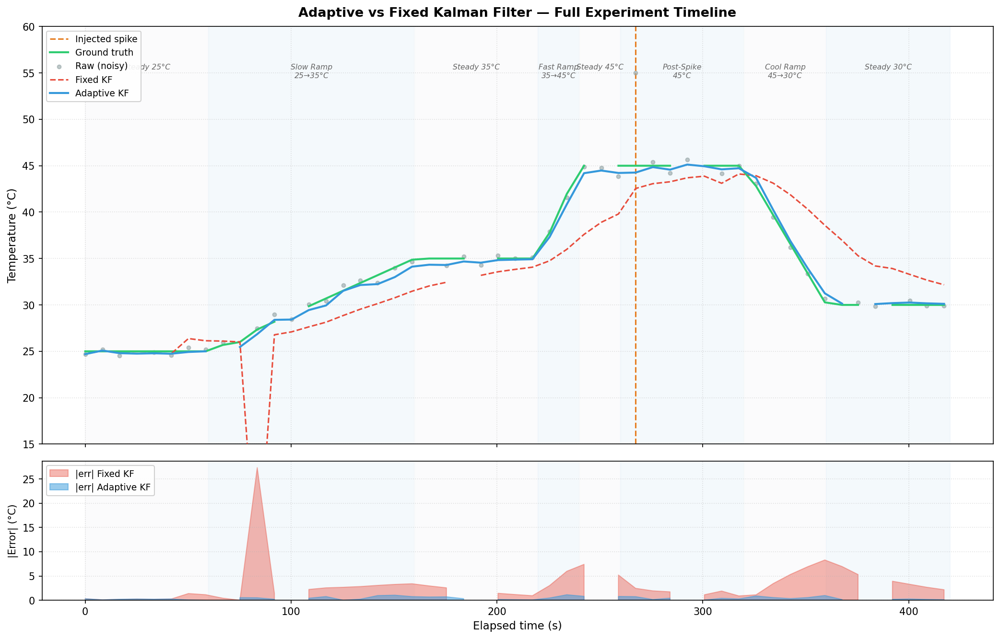
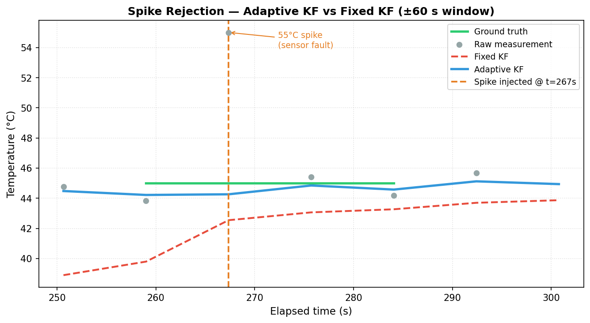
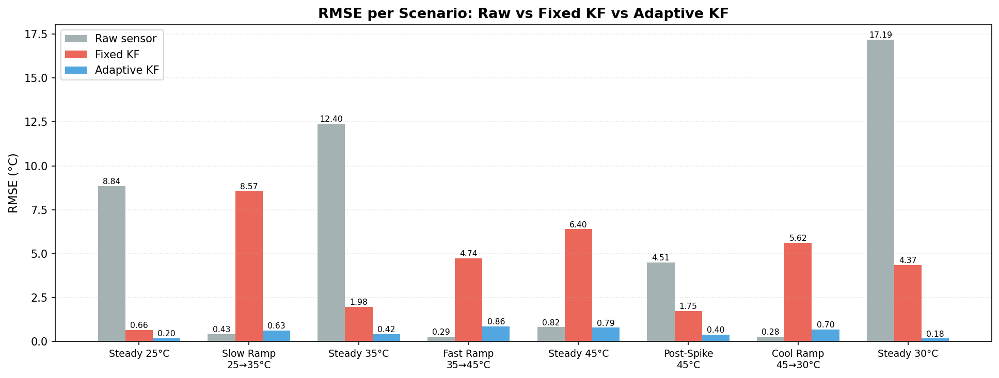
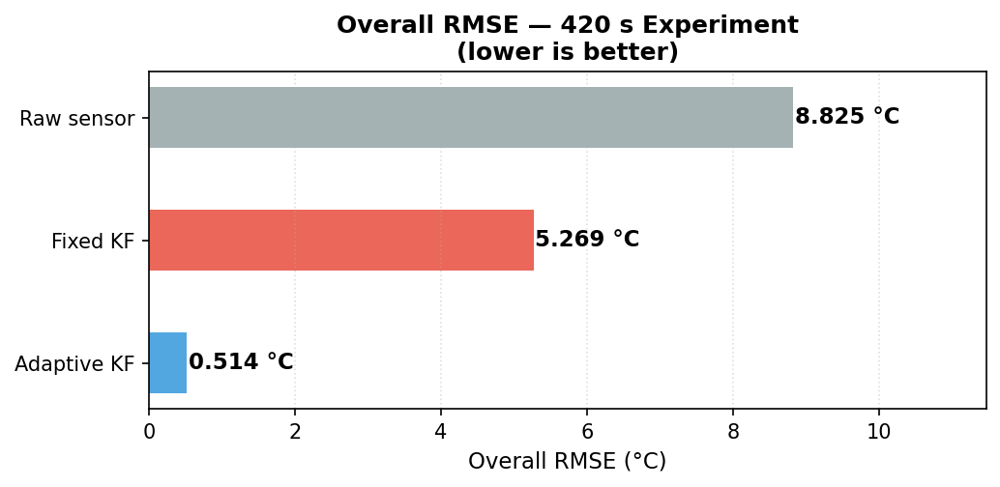
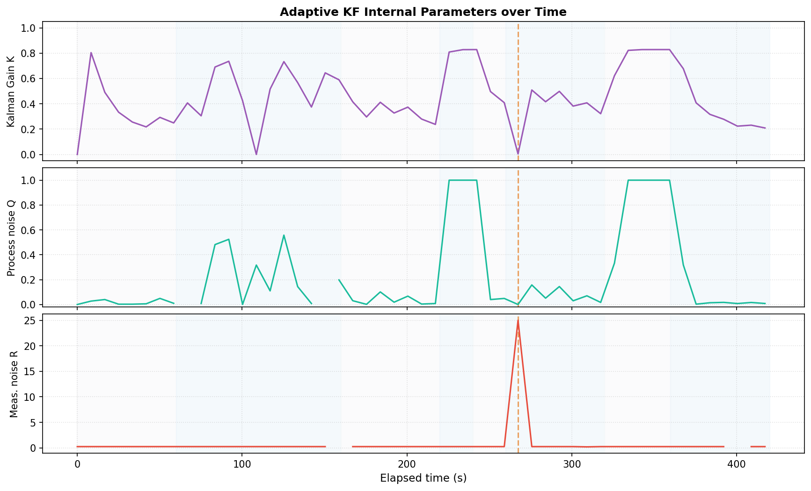
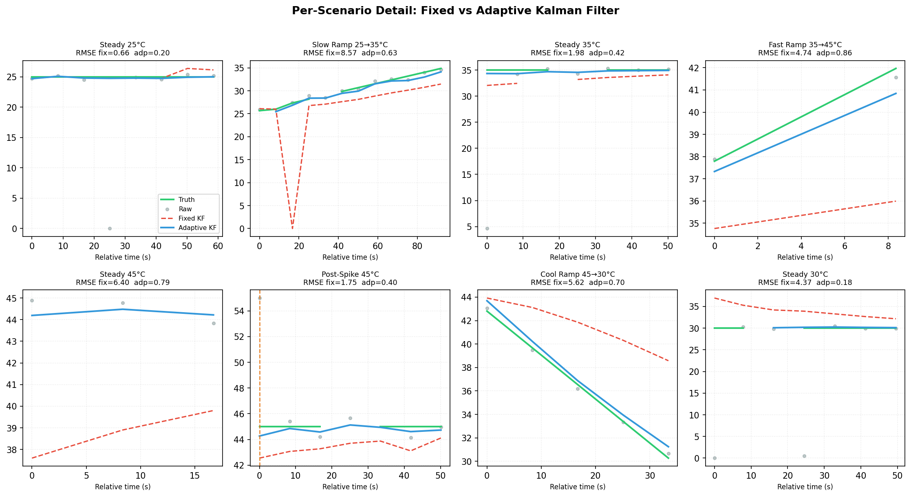

## Your CSV Has Corrupted Values — Clean First, Then Plot


# Adaptive vs Fixed Kalman Filter — STM32 Testbench

> A controlled scientific experiment comparing a fixed-parameter 
> Kalman filter against an adaptive one for temperature estimation
> on a $2 microcontroller.

## Hardware
| Component | Role |
|-----------|------|
| STM32 Blue Pill (STM32F103C8T6) | MCU |
| DHT22 | Temperature + humidity sensor |
| DS1307 RTC | Hardware-validated wall-clock timestamps |
| LCD2004 (I²C) | Real-time display |
| 2× 4.7 kΩ resistors | I²C pull-ups |

> All I²C communication is **bit-bang** (no HAL, no Wire library) — 
> full control, zero abstraction.

## Wokwi Simulation
▶️ [Run it in your browser — no hardware needed](YOUR_WOKWI_LINK)

## Results

### Full Experiment Timeline (420 s, 8 scenarios)


### Spike Rejection — The Key Differentiator
At t = 267 s a **55°C fault spike** was injected.  
The adaptive filter rejected it in a single sample.  
The fixed filter tracked it blindly.



### RMSE Per Scenario


### Overall RMSE


### Adaptive KF Internal Parameters
Kalman gain K drops to ~0.004 the moment the spike appears —  
the filter automatically distrusts the measurement.



### Per-Scenario Detail


## How the Adaptive Filter Works
The filter tunes Q and R in real time based on **innovation rate**
(how fast the reading is changing vs. what is physically possible):

- `apparent_rate > max_phys_rate` → spike detected → `R` inflated
  100× → K → ~0 → measurement almost ignored
- `apparent_rate ≤ max_phys_rate` → Q scaled with rate²·dt → 
  filter tracks genuine ramps without lag

## Reproduce
```bash
git clone https://github.com/MohamedMehery/Kalmanfilter_lab
cd DHT22_temprature_humidty
pip install pandas matplotlib numpy
python plot_kalman_results.py
```
Open `diagram.json` + `main.cpp` in [Wokwi](https://wokwi.com).

## Project Structure
```
├── main.cpp               # Full firmware (Arduino/STM32)
├── diagram.json           # Wokwi circuit
├── kalman_results.csv     # Raw serial output
├── plot_kalman_results.py # This plotting script
└── plots/                 # Generated figures
```
```

---

## 💼 Step 3: The LinkedIn Post — With a Dignified Job Ask

Here is a complete ready-to-paste post. The job ask at the end is honest and confident without sounding desperate:

```
I ran a controlled experiment on a $2 microcontroller.
One filter followed a 55°C sensor fault blindly.
The other rejected it in a single sample.

Here's the full breakdown 👇

──────────────────────────────────

THE SETUP
• STM32 Blue Pill (Cortex-M3, $2)
• DHT22 temperature sensor
• DS1307 RTC — hardware clock, independent of the MCU
• LCD2004 — real-time display
• Everything on Wokwi — run it free in your browser

No HAL. No Wire library. I2C is fully bit-banged.

──────────────────────────────────

THE EXPERIMENT (8 scenarios, 420 seconds)

✅ Steady state at 25°C
✅ Slow ramp 25→35°C over 100 s
✅ Steady state at 35°C
✅ Fast ramp 35→45°C over 20 s
✅ Injected 55°C spike at t = 267 s  ← the interesting part
✅ Cool ramp 45→30°C
✅ Steady state at 30°C

Two filters running in parallel, same input, every sample logged
to CSV with RTC wall-clock timestamps.

──────────────────────────────────

THE KEY RESULT

Fixed KF   → Kalman gain K = 0.22 → tracked the fault ❌
Adaptive KF → K dropped to 0.004  → rejected the fault ✅

The adaptive filter monitors innovation rate.
When temperature "changes" faster than physics allows,
it inflates R by 100×.  The measurement is almost ignored.
One sample. No human intervention.

Full RMSE breakdown across all 8 scenarios is in the carousel.

──────────────────────────────────

WHY THIS MATTERS FOR REAL SYSTEMS

Sensor faults, EMI spikes, and wiring noise are facts of life
in industrial and automotive embedded systems.
A filter that can't distinguish "real change" from "bad data"
cannot be deployed in safety-relevant applications.

──────────────────────────────────

WHAT'S NEXT

This is the first in a series I'm building on
edge intelligence for constrained hardware:

→ TinyML anomaly detection on Cortex-M
→ Online learning on microcontrollers

──────────────────────────────────

📂 Full code, CSV data, and all plots on GitHub.
    Link in the comments.

──────────────────────────────────

A personal note:

I'm currently looking for my next role in embedded systems,
firmware engineering, or IoT — and the search has been tough.

If you're working on hardware that needs to be smart, robust,
and deployable on constrained devices, I'd genuinely love
to contribute to that work.

Open to roles in embedded firmware, edge AI, or sensor systems.
Feel free to reach out or simply follow along as I keep building.

#EmbeddedSystems #KalmanFilter #STM32 #IoT #SignalProcessing
```

email: mohameda.mehery@gmail.com
whatsapp: +20-1288761365
---
