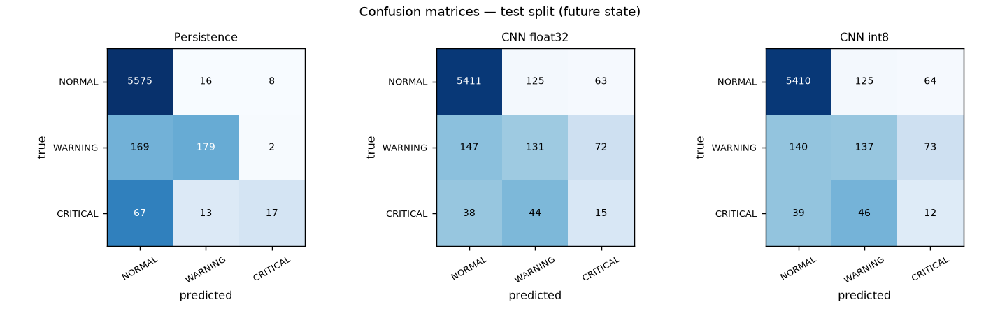
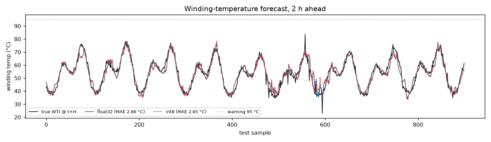
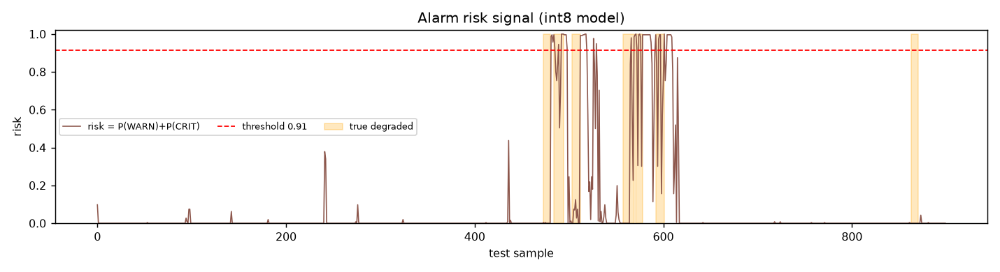
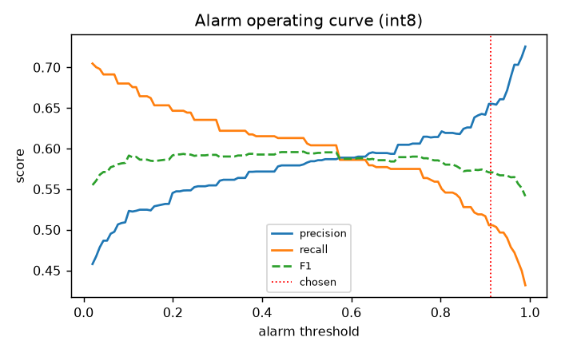
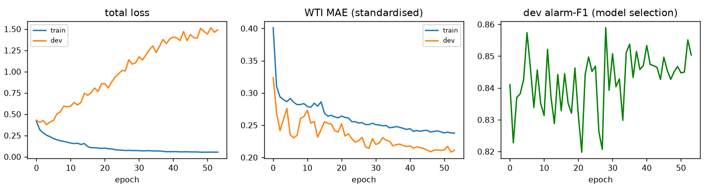
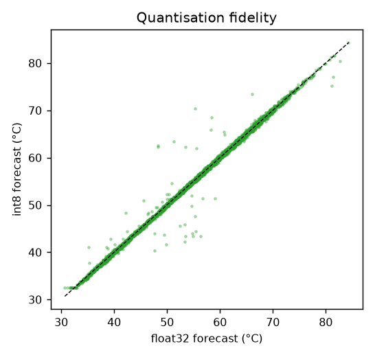

# Evaluation report — Transformer predictive maintenance

Test windows: **6,046**  |  horizon: **8 samples (2.0 h)**  |  window: **16 samples**

## 1. Three-class future-state accuracy

| model | accuracy | macro-F1 |
|---|---|---|
| persistence | 95.45 % | 0.6310 |
| rule-on-now | 95.45 % | 0.6310 |
| rule-on-forecast | 95.45 % | 0.6310 |
| CNN float32 | 91.91 % | 0.4971 |
| CNN int8 | 91.95 % | 0.4937 |

> The 3-class task is **persistence-dominated**: the state rarely changes inside one horizon, so a model that simply echoes the current state already scores very high accuracy. Accuracy alone is therefore *not* evidence that the model learned anything. The metrics that matter are below.

## 2. Early warning (the part that is actually useful)

Windows that look healthy **now** but degrade within the horizon: **236**

| model | early-warning recall |
|---|---|
| persistence | 0.0 % (0 by construction) |
| rule on forecast WTI | 0.0 % |
| CNN float32 | 33.1 % |
| CNN int8 | 36.0 % |

## 3. Alarm head (deployed decision)

`risk = P(WARNING) + P(CRITICAL)`, threshold **0.913** chosen on the dev split at a 1.0 % false-alarm budget.

| model | precision | recall | F1 | false-alarm rate |
|---|---|---|---|---|
| float32 | 65.4 % | 50.8 % | 0.572 | 2.14 % |
| int8 | 65.5 % | 50.6 % | 0.571 | 2.13 % |

## 4. Winding-temperature forecast

| model | MAE (°C) | RMSE (°C) |
|---|---|---|
| naive (WTI stays put) | 6.247 | — |
| CNN float32 | 2.660 | 3.455 |
| CNN int8 | 2.652 | — |

Target std on test: 10.17 °C. The regression head beats the naive carry-forward by 57 %.

## 5. Quantisation

- TFLite size: **17,904 bytes (17.5 KB)**
- argmax agreement float vs int8: **99.22 %**
- alarm-bit agreement: **99.40 %**
- WTI MAE change: 2.660 -> 2.652 °C

## Plots

